# Fitness Bot

## Функционал

### Профиль
[[README.md#Профиль]]
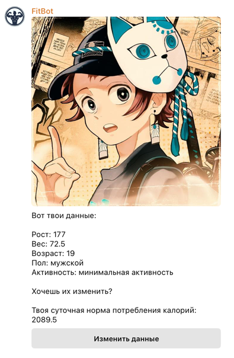

Реализовано удобное меню для редактирования каждого из параметров

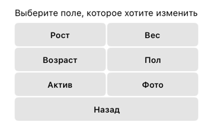

Суточная норма калорий рассчитывается только в случае, если все необходимые параметры введены пользователем
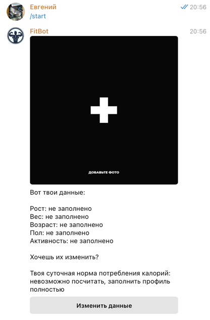

### Подсчет калорий еды
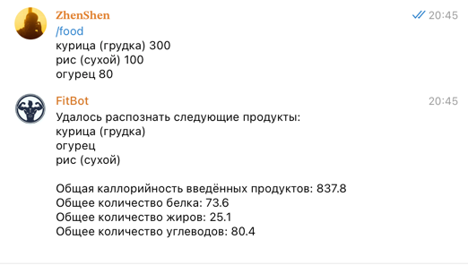

### Подсчет калорий, сожжённых на тренировке
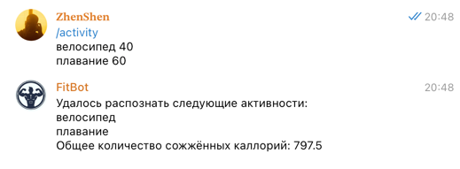

Расчеты опираются на введенные пользователем поля в профиле. Если данных не хватает, расчёты выполнены не будут

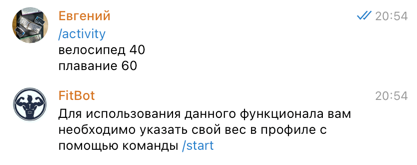

### Подсчет калорий из голосового сообщения
Данная функция работает как с тренировками, так и с едой 

Диктовать информацию можно в свободном формате

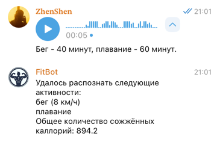

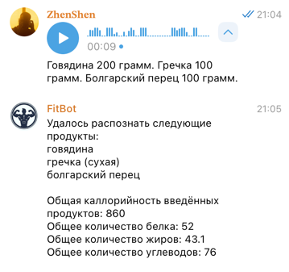

### Премиум-подписка
Функционал распознавания голоса является премиум-функцией и для её использования необходимо приобрести подписку. Изначально у каждого пользователя есть по 5 пробных попыток

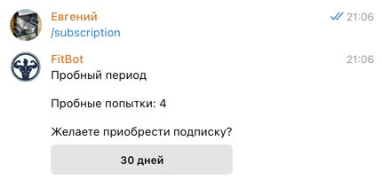

Покупка осуществляется за Telegram Stars

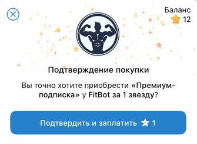

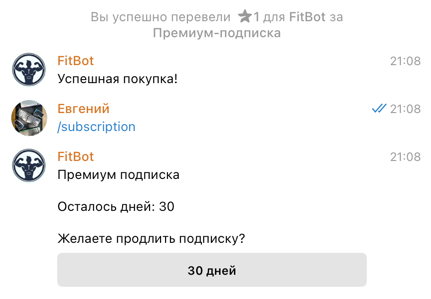

## Реализация

### Используемые технологии
- Spring Framework
- Telegram Bots (библиотека для работы с Telegram API на Java)
- PostgresSQL
- OpenAI API
- Vosk (технология распознавания голоса)

### Общая архитектура
Проект поделен на слои абстракции для удобства разработки и дальнейшей поддержки

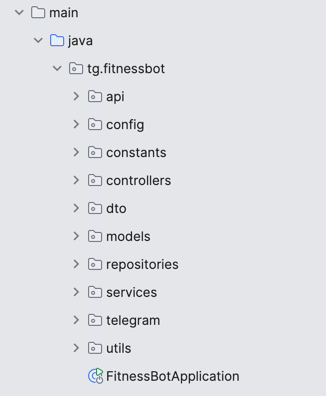 

### Профиль